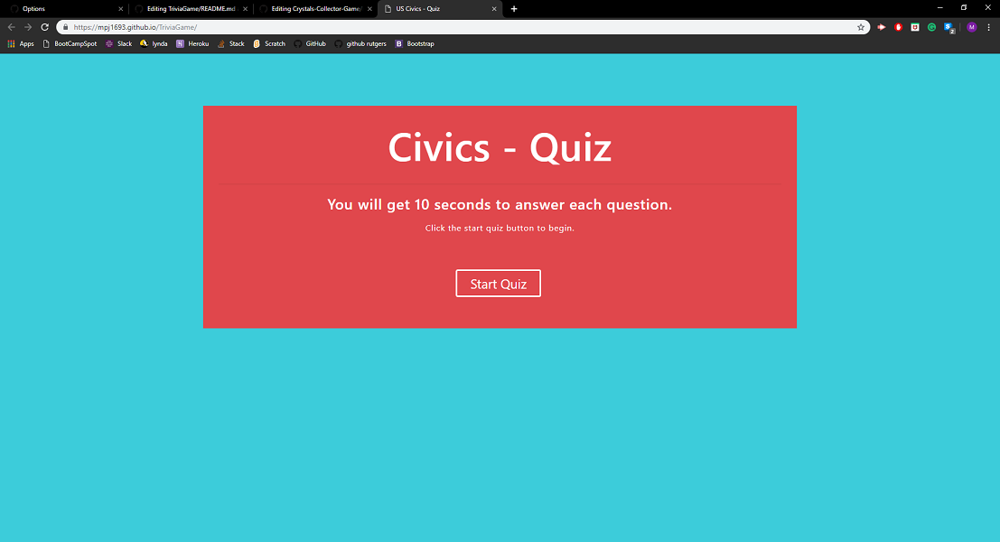
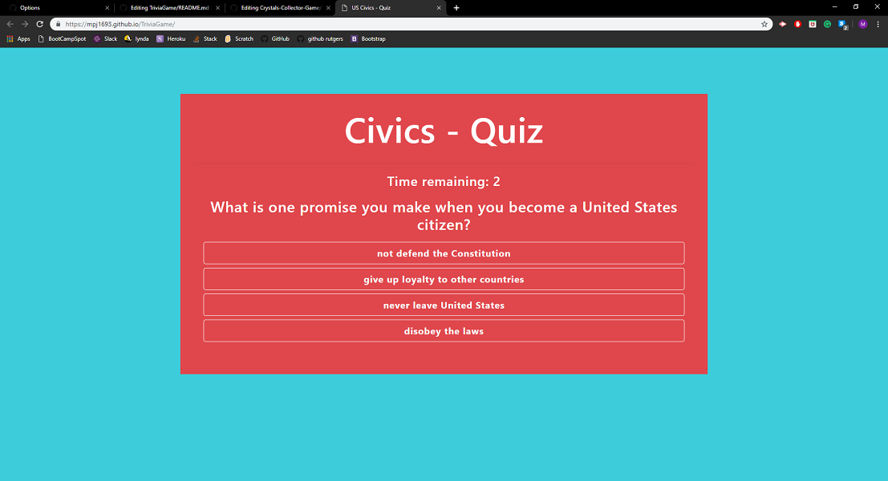
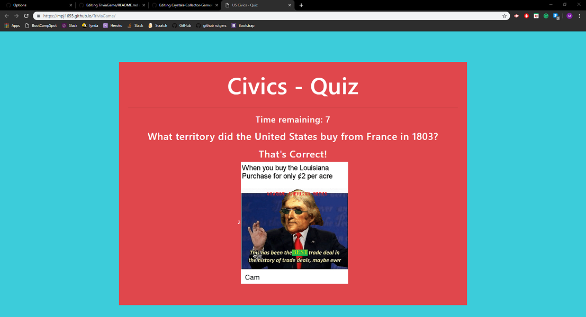
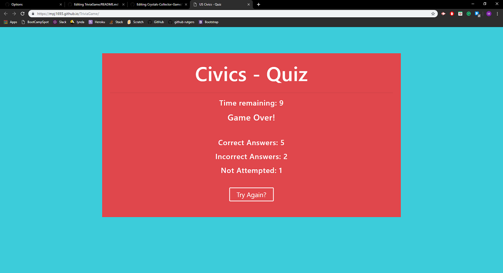

# TriviaGame

## Civics - Quiz

### Link: https://mpj1693.github.io/TriviaGame/

### Overview

This is a simple quiz game with timer. There are 8 questions on the history and government of the United States. Ten seconds of time will be given for each question. In the end you will be able to see the total number of correct, incorrect and unanswered questions.

### Languages

* Javascript
* HTML
* CSS

### Explaination

* This is the home page of this quiz

* Once the start button is clicked on the home page, this page opens. It has a questoin and four options. Also timer is displayed.

* Once you click on one of the options or when the time runs out, the page below is displayed. It will tell you if the answer you selected was right or wrong. If it was wrong it will tell you the correct answer. And below that a gif or photo will be displayed.

* After the last question, result page will be displayed with the information about total number or correct, incorrect and unanswered questions. It will also display a button to restart the quiz.

### Author

Manav Patel
